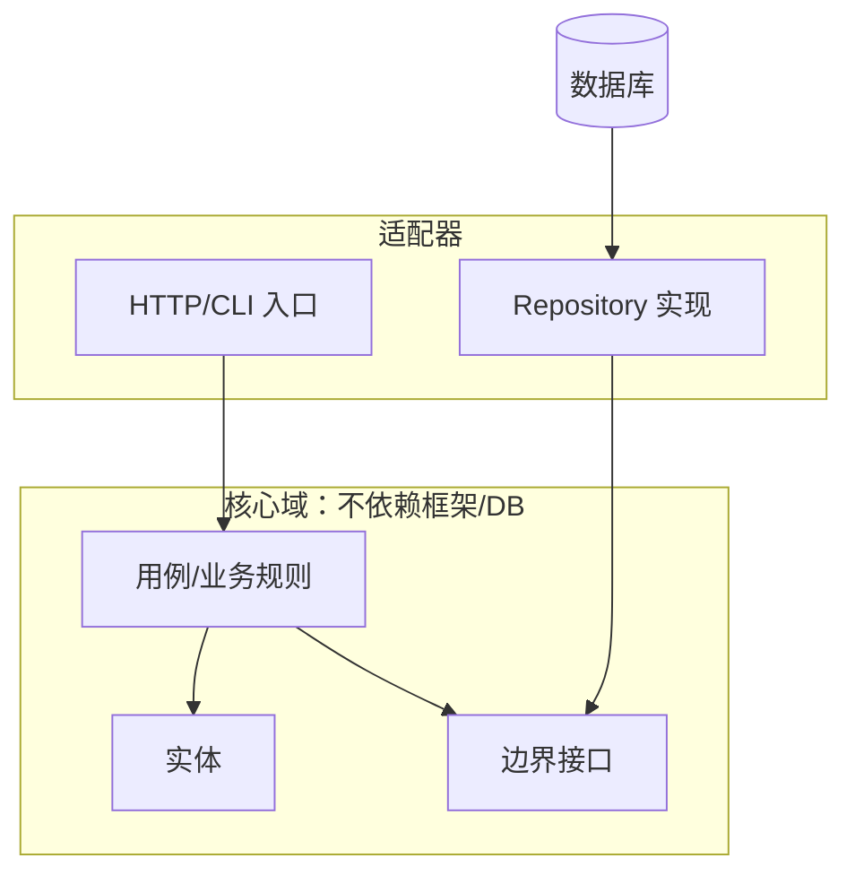

# 代码架构设计

> 写作说明：
> - 本文件把《实现逻辑与方案设计》落到**架构层面**：模块边界、依赖方向、可测试性、可维护性、可读性，面向可实施。
> - 给出目录结构、模块接口、测试策略与验证回路；不陷入具体代码写法。
> - **学术场景适配（可视化、结果输出、可复现）在本文件定义，流程三只照做。**
> - 引用流程一文献一律用 Obsidian wikilink `[[<论文短名>|<作者 年份>]]` 可点击跳转（见 `standards/通用写作规范.md` §4）。
> - 规范依据：`standards/解决方案-代码架构设计.md`（v3.1）。

## 1. 架构决策记录（ADR 摘要）

| 决策点 | 选择 | 备选 | 取舍/理由 | 回访触发 |
|--------|------|------|-----------|----------|
| 架构风格（单体/模块化单体/微服务/Serverless/事件驱动） | | | | |
| 模块边界划分（按什么切） | | | | |
| 技术栈（语言/框架/依赖） | | | | |
| 数据存储与一致性 | | | | |
| 关键模式（CQRS/事件驱动/缓存/…） | | | | |

## 2. 架构总览图（依赖方向指向核心）

> 检查：所有依赖箭头指向核心；核心不 import 框架/DB。

## 3. 技术栈

- **语言 / 框架 / 关键依赖**：
- **版本与环境**：（如 Python 3.x、Node 版本、GPU 需求）
- **选型理由**：（简短，对应 ADR 行）

## 4. 目录结构（目录即架构）

    project/
    ├── core/                 # 核心业务规则（不依赖框架/DB）
    │   ├── entities/         # 领域实体/纯逻辑
    │   ├── use_cases/        # 用例（应用规则）
    │   └── interfaces/       # 边界接口（内层定义）
    ├── adapters/             # 适配器（实现 core 接口）
    │   ├── repository/       # 持久化实现
    │   └── web/              # HTTP/CLI 入口
    ├── reporting/            # 可视化与结果导出（图/表生成）
    ├── config/               # 配置/组合根（装配依赖 + 实验配置）
    ├── data/                 # 数据（输入/输出）
    ├── results/              # 实验结果（指标/日志）
    ├── figures/              # 论文用图（SVG/PDF/300dpi PNG）
    ├── tables/               # 论文用表（CSV/JSON/LaTeX）
    ├── tests/                # 测试（core 测试不依赖 DB/网络）
    └── README.md

## 5. 模块职责与接口

| 模块 | 职责 | 关键接口（函数/类） | 依赖 | 可测性说明（怎么测/mock 什么） |
|------|------|--------------------|------|-------------------------------|
| core.use_cases | | `func_a(input) -> output` | 仅 core.interfaces | 直接单测，无需 DB/网络 |
| adapters.repository | | 实现 interfaces | core | 集成测试用真实/内存 DB |
| reporting.viz | 生成出版级图表 | `plot_metrics(df) -> Path` | core | 用固定样例数据测试输出文件 |

## 6. 数据流

- 输入 → 适配器入口 → 用例 → 实体 → 输出
- 跨边界数据用 DTO，不用 ORM 实体/框架对象
- 标注每个环节的数据形态；结果统一写入 `results/` → `figures/`、`tables/`

## 7. 测试策略与验证回路

- **测试金字塔**：单测（核心逻辑，为主）→ 集成（模块间）→ E2E（最少）
- **阶段验收命令**：每阶段「跑什么命令、看什么输出」算完成
- **自校正回路**：先写失败测试 → 最小实现 → 重跑 → 通过 → 重构；测试失败时据失败信息改代码，改后重跑；完成声明附验证证据
- **效果验证**：对照《场景分析与问题剖析》的评价指标

## 8. 实现顺序（分阶段，每阶段带验收测试）

- **阶段一（最小闭环）**：核心用例 + 先红后绿的单测，产出可运行 demo + 通过测试
- **阶段二（完善）**：补齐适配器、错误处理、集成测试
- **阶段三（工程化）**：配置化、日志、打包、性能验证

## 9. 演进与维护

- **换 DB**：只动 adapters/repository，核心不动（依赖规则证明）
- **加模块**：遵循边界与依赖方向，更新 ADR
- **拆服务**：触发条件（团队/流量/部署需求），对应 ADR 回访

## 10. 学术场景适配（流程三照做）

### 10.1 可视化设计

- **图表清单**：（对应 02 实验设计，列出每个实验产出哪些图）
| 实验 | 图表 | 格式 | 用途 |
|------|------|------|------|
| 主对比 | 指标对比柱状图 | SVG + 300dpi PNG | 论文正文 Figure |
- **统一风格**：字体（如 Arial 10pt）、配色、线宽、图例位置、坐标轴命名
- **图注规范**：`Figure N: 标题。说明` / `Table N: 标题`

### 10.2 结果输出

- 三件套：`results/*.csv`（原始指标）+ `results/*.json`（元数据：配置/种子/环境）+ `tables/*.tex`（LaTeX 表格）
- 命名规则：`<实验名>_<seed>_<时间戳>`

### 10.3 可复现

- 随机种子：全局固定 + 各库可指定；`--seed` 参数
- 配置落盘：每次实验保存一份 `config` 快照到 `results/`
- 依赖锁定：`requirements.txt` / lockfile，注明 Python/框架/GPU 版本

### 10.4 实验管理

- 重复实验：`--repeat N`，输出均值/方差/置信区间
- 统计显著性：检验方法（如配对 t 检验 / Wilcoxon）与多重重复次数
- 日志：INFO/DEBUG 分级，关键指标自动汇总到 `results/summary.csv`
